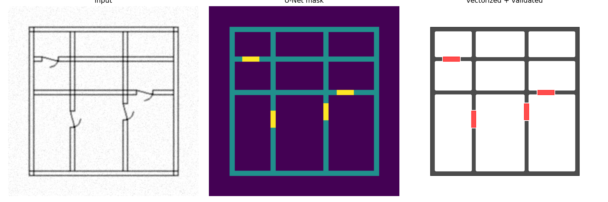

# ArchVision: Floorplan Segmentation and Vectorization Pipeline

An end-to-end pipeline that generates synthetic CAD floorplans, trains a U-Net to segment walls and doors, converts the predicted masks into clean vector geometry, and exports a layered DXF. Everything runs offline on CPU with no API calls.



*Left to right: input raster, U-Net segmentation mask, vectorized and validated geometry.*

## Pipeline

```
procedural plan generator (Shapely)
        |
        v
  DXF export (ezdxf)  --->  rasterized image + class mask
                                      |
                                      v
                            PyTorch U-Net (trained from scratch)
                                      |
                                      v
                        predicted class mask (wall / door)
                                      |
                                      v
              OpenCV contours + hierarchy  ->  Shapely polygons (RDP simplified)
                                      |
                                      v
                     geometry inspect-and-repair loop
                                      |
                                      v
                             layered DXF output
```

## What each stage does

| Stage | File | Details |
|---|---|---|
| Data generation | `src/gen_data.py` | Procedurally builds floorplans (outer walls, partitions, door gaps) as Shapely geometry, writes layered DXF files, and rasterizes each plan into a noisy line-drawing image and a 3-class mask |
| Dataset and augmentation | `src/dataset.py` | PyTorch `Dataset` with flips, 90-degree rotations, and brightness/contrast jitter applied jointly to image and mask |
| Model | `src/model.py` | 4-level U-Net with skip connections, BatchNorm, and transposed-convolution upsampling |
| Training | `src/train.py` | AdamW, cosine LR schedule, class-weighted cross-entropy plus Dice loss, per-class IoU and mIoU evaluation |
| Vectorization | `src/vectorize.py` | Morphological cleanup, `cv2.findContours` with `RETR_CCOMP` hierarchy to preserve holes (rooms), conversion to Shapely polygons, Ramer-Douglas-Peucker simplification |
| Validation | `src/validate.py` | Iterative loop that detects invalid polygons, tiny specks, overlapping walls, and floating doors, applies repairs, and re-inspects until clean |
| Export | `src/export_dxf.py` | Writes walls and doors to separate DXF layers, including polygon holes |
| Inference | `src/run_pipeline.py` | Runs the full chain on an input image and saves a visualization plus DXF |

## Results

Trained for 20 epochs on 680 plans, evaluated on 120 held-out plans (CPU only, about 36 seconds per epoch).

| Class | IoU |
|---|---|
| Background | 1.000 |
| Wall | 0.999 |
| Door | 0.979 |
| **mIoU** | **0.993** |

### Geometry validator demo

`src/test_validate.py` builds a deliberately corrupted set of geometry (a hairline gap between walls, duplicate overlapping walls, a tiny speck, and a door far from any wall). The repair loop finds 5 issues on the first pass and reaches 0 on the second, merging the walls into a single polygon and dropping the floating door.

```
BEFORE: {'tiny': 1, 'overlap': 3, 'floating_door': 1}
[validate] iter 0: 5 issues
[validate] iter 1: 0 issues
AFTER:  {}
walls 5 -> 1, doors 2 -> 1
```

## Limitations

Read these before trusting the numbers.

- **The data is synthetic and easy.** All plans are axis-aligned rectangular layouts with fixed wall thickness and simple door gaps. The 0.993 mIoU reflects that distribution, not real scanned blueprints. The model has never seen a real floorplan and should be expected to fail on one.
- **The validator does not fire on model output.** On this dataset the U-Net predictions are already clean, so the repair loop reports 0 issues in normal runs. Its behavior is demonstrated only on the hand-built test case above.
- **Repair is destructive.** Gap snapping and overlap merging collapse the walls into one merged polygon, so individual wall segments are not preserved.
- **Two classes only.** The model segments walls and doors. There is no support for windows, columns, stairs, or room labeling.
- **Vectorization uses pixel coordinates.** Output geometry is in image pixels, not real-world units, and contour coordinates sit at pixel centers, so walls come out slightly thinner than their true width.

## Setup

Requires Python 3.10 or newer.

```powershell
python -m venv .venv
.venv\Scripts\Activate.ps1
pip install -r requirements.txt
```

## Usage

Run everything from the repo root with `python -m`:

```powershell
# 1. Generate 800 synthetic plans (DXF + image + mask)
python -m src.gen_data

# 2. Train the U-Net (saves checkpoints/unet_best.pt)
python -m src.train

# 3. Run inference, vectorization, validation, and DXF export on one image
python -m src.run_pipeline data\images\plan_0799.png

# 4. Run the validator demo
python -m src.test_validate
```

Outputs are written to `outputs/`: a visualization PNG and `result.dxf`. The last 15 percent of generated plans (index 680 onward) are the validation split, so `plan_0799` is a held-out example.

## Project layout

```
archvision/
  src/
    gen_data.py
    dataset.py
    model.py
    train.py
    vectorize.py
    validate.py
    export_dxf.py
    run_pipeline.py
    test_validate.py
  docs/demo.png
  requirements.txt
```

## Possible extensions

- Harder synthetic data: heavier noise, blur, rotations, and non-rectangular rooms, with a reported robustness curve
- Evaluation on real public floorplan datasets to measure the synthetic-to-real gap
- In general, more training data, real or fake. 
- More classes (windows, columns) and instance separation of individual walls
- Orthogonal edge regularization to snap near-axis-aligned edges
